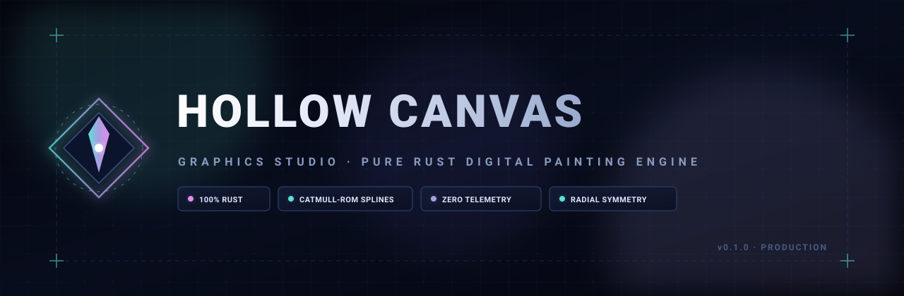

# Hollow Canvas · Graphics Studio

<div align="center">



**A modern, high-performance, local-first digital painting and graphics studio built with 100% pure Rust.**

[](https://www.rust-lang.org)
[](LICENSE.md)
[](https://github.com/LeTrollologist/Hollow-Canvas)
[](CONTRIBUTING.md)

</div>

---

## 🌟 Overview

**Hollow Canvas** is a lightweight, studio-grade digital illustration and raster graphics workbench engineered from the ground up in Rust. Designed for artists, concept designers, and technical illustrators who demand absolute precision, low latency, and deterministic offline reliability.

### Key Highlights

- 🎨 **Floating Mixing Scratchpad (<kbd>F4</kbd>)**: Persistent off-canvas color mixing dock for scribbling, smudging pigments, and eyedropper sampling without modifying the main document or history.
- ⚡ **Subpixel-Antialiased High-Frequency Engine**: Guaranteed physical sub-pixel antialiasing transition bands across all hardness levels, with true Catmull-Rom spline tangent curvature and S-Level Global Stroke Stabilization (S-0 through S-7 Lazy Rope).
- 📁 **Nested Layer Groups (Folders)**: Hierarchical folder management with collapsible trees, ancestor visibility/opacity inheritance, and one-click group duplication/ungrouping.
- 🖌️ **Selection Brush & Eraser**: Direct 8-bit alpha mask painting and erasing with brush dynamics, hardness falloff, and live ruby quick-mask overlay.
- 🎨 **Modern Studio Toolset**: Brush, Pencil, Watercolor (wet edge/falloff simulation), Chalk (grain dispersion), Spray (stochastic scatter), Smudge (directional velocity smear), Linear & Radial Gradients, Magic Wand fuzzy selection, Eraser modes (Soft, Hard 1-Bit, Color-Target), Dual-Color Vector Shapes, and Reference-layer Flood Fill.
- 🔒 **Layer Alpha Lock & Clipping Masks**: Protect layer transparency (`Alpha Lock`) or clip layers directly to underlying art bounds (`Clipping Mask`).
- 👁 **Zen / Full Canvas Mode**: Toggle all UI docks and toolbars with <kbd>Tab</kbd> for pure, distraction-free illustration with floating restore controls.
- ✦ **New Canvas Studio**: Pre-loaded potentials (1K/2K/4K Square, 1080p/4K Displays, A4/A5 Print @ 300 DPI, Social Media Banners, Pixel Art) and custom dimensions with aspect-ratio locking.
- 📐 **Symmetry & Grid Overlays**: Real-time Horizontal, Vertical, Quad, and multi-segment Radial/Mandala symmetry, with toggleable pixel grids (8px–128px) and dynamic viewport rulers.
- 💡 **Reference Lightbox**: Floating reference image dock with toggleable high-contrast white lightbox and checkerboard backlight modes.
- 🛡️ **Zero-Allocation Rendering**: Highly optimized software rendering pipeline with reusable composite buffers for silky smooth 60+ FPS viewport navigation and drawing.
- 🔒 **Local-First & Chain of Trust**: Completely offline, zero telemetry, no trackers, and local project serialization via binary compressed archives (`.hcv`) alongside Ed25519-signed `.vpack` releases.

---

## 🏗️ Architecture

The workspace is organized into modular, decoupled Rust crates:

```text
Hollow Canvas/
├── assets/           # Application icons (SVG, ICO, PNG) and banner art
├── crates/
│   ├── hollow-core/  # Core data models, blend modes, symmetry, layer stack, and rasterizers
│   ├── hollow-render/# Software renderer, texture caching, grid/ruler overlays, and UI primitive composition
│   ├── hollow-io/    # Binary HCV project serialization, PNG export, and file parsing
│   ├── hollow-ui/    # Modern egui-based dock panels, tools shelf, color palettes, and modals
│   └── hollow-app/   # Native Win32 desktop application orchestrator and message loop
```

---

## 🚀 Installation & Getting Started

Hollow Canvas can be installed as a portable native binary, via the **VPack Archiver** ecosystem, or compiled directly from source.

### Option 1: Install with VPack (Recommended)

[**VPack Archiver**](https://github.com/LeTrollologist/vpack-archiver) is the high-performance universal archive manager for `.vpack` packages.

1. Download [`hollow-canvas-v0.15.0-windows-x86_64.vpack`](https://github.com/LeTrollologist/Hollow-Canvas/releases/latest) and [`hollow-publisher.pub`](https://github.com/LeTrollologist/Hollow-Canvas/releases/latest) from the latest release.
2. Extract the package with `vpack`:
   ```bash
   # Extract all files
   vpack extract hollow-canvas-v0.15.0-windows-x86_64.vpack

   # Or extract to a custom directory
   vpack extract hollow-canvas-v0.15.0-windows-x86_64.vpack -o ./HollowCanvas/
   ```
3. *(Optional)* Verify Ed25519 signature and CRC-32 integrity:
   ```bash
   vpack test hollow-canvas-v0.15.0-windows-x86_64.vpack
   ```
4. Run `hollow-canvas.exe`.

---

### Option 2: Install with Native Portable Zip

No additional archive tools required — works with standard Windows extraction:

1. Download [`hollow-canvas-v0.15.0-windows-x86_64.zip`](https://github.com/LeTrollologist/Hollow-Canvas/releases/latest) from the latest release.
2. Extract the zip file using PowerShell or Windows Explorer:
   ```powershell
   Expand-Archive -Path .\hollow-canvas-v0.15.0-windows-x86_64.zip -DestinationPath .\HollowCanvas
   ```
3. Double-click `HollowCanvas\hollow-canvas.exe` to launch immediately.

---

### Option 3: Compile from Source (Pure Rust)

If you prefer building from source with full compiler optimizations:

**Prerequisites:**
- [Rust Toolchain](https://www.rust-lang.org/tools/install) (1.75+ recommended)
- Windows 10 / 11 (64-bit)

1. Clone the repository:
   ```bash
   git clone https://github.com/LeTrollologist/Hollow-Canvas.git
   cd Hollow-Canvas
   ```

2. Run the test suite:
   ```bash
   cargo test --workspace
   ```

3. Build and launch:
   ```bash
   cargo run --release -p hollow-app
   ```

---

## ⌨️ Keyboard Shortcuts & Controls

| Action | Shortcut |
| :--- | :--- |
| **Zen / Full Canvas Mode** | <kbd>Tab</kbd> |
| **Mixing Scratchpad Dock** | <kbd>F4</kbd> |
| **Reference Lightbox Dock** | <kbd>F3</kbd> |
| **Brush Tool** | <kbd>B</kbd> |
| **Pencil Tool** | <kbd>P</kbd> |
| **Magic Wand Tool** | <kbd>W</kbd> |
| **Gradient Tool** | <kbd>G</kbd> |
| **Eraser Tool** | <kbd>E</kbd> |
| **Eyedropper (Pick Color)** | <kbd>I</kbd> or <kbd>Alt</kbd> + Click |
| **Marquee Select** | <kbd>M</kbd> |
| **Move / Pan View** | <kbd>V</kbd> (Drag) |
| **Viewport Pan** | <kbd>Space</kbd> + Drag or Middle Mouse Drag |
| **Viewport Zoom** | <kbd>Mouse Wheel</kbd> |
| **Swap Primary/Secondary Color** | <kbd>X</kbd> |
| **Create New Canvas** | <kbd>Ctrl</kbd> + <kbd>N</kbd> |
| **Toggle Canvas Grid** | <kbd>Ctrl</kbd> + <kbd>'</kbd> |
| **Toggle Canvas Rulers** | <kbd>Ctrl</kbd> + <kbd>R</kbd> |
| **Commit Polygon / Crop** | <kbd>Enter</kbd> |
| **Cancel Polygon / Deselect** | <kbd>Esc</kbd> or <kbd>Ctrl</kbd> + <kbd>D</kbd> |
| **Undo** | <kbd>Ctrl</kbd> + <kbd>Z</kbd> |
| **Redo** | <kbd>Ctrl</kbd> + <kbd>Y</kbd> or <kbd>Ctrl</kbd> + <kbd>Shift</kbd> + <kbd>Z</kbd> |
| **Save Project** | <kbd>Ctrl</kbd> + <kbd>S</kbd> |
| **Export PNG** | <kbd>Ctrl</kbd> + <kbd>E</kbd> |
| **Open Project** | <kbd>Ctrl</kbd> + <kbd>O</kbd> |

---

## 🤝 Contributing

Contributions are welcome! Please feel free to submit issues, feature requests, or pull requests.

1. Fork the repository
2. Create your feature branch (`git checkout -b feature/amazing-feature`)
3. Commit your changes (`git commit -m 'Add amazing feature'`)
4. Push to the branch (`git push origin feature/amazing-feature`)
5. Open a Pull Request

---

## 📄 License

This project is licensed under the terms of the **GNU General Public License v3.0** (GPL-3.0). See [LICENSE.md](LICENSE.md) for details.

---

<div align="center">
  <sub>Crafted with passion by <a href="https://github.com/LeTrollologist">LeTrollologist</a>.</sub>
</div>
